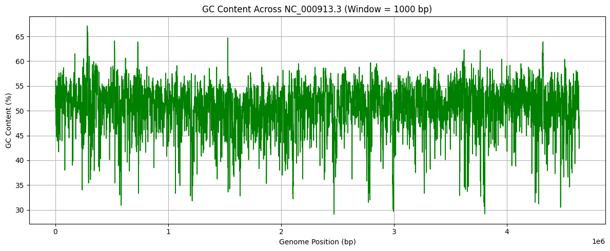

# 🔬 GC Content Analysis of a Genome

## 🧬 Overview

This project calculates and visualizes the **GC content** across a genome using a **sliding window approach**. GC content is an important genomic feature that influences DNA structure, gene expression, and evolutionary adaptations.

By analyzing a genomic FASTA file (e.g., from *Escherichia coli*), the script computes GC percentage in fixed-length windows (e.g., 1000 base pairs) and plots the variation across the genome. This helps identify **GC-rich** and **GC-poor** regions, which may correspond to coding areas, structural domains, or regulatory elements.

---

## 📌 Key Features

- Parses **FASTA** genome files using Biopython  
- Calculates **GC content** using a sliding window (default: 1000 bp)  
- Exports results to a **CSV file**  
- Generates a **plot** showing GC variation across the genome  
- Highlights biologically significant regions with high/low GC content  

---

## 🛠️ Technologies & Libraries Used

- **Python 3.x**  
- **Biopython** – for FASTA file parsing  
- **Matplotlib** – for plotting  
- **CSV** – for storing tabular GC content output  

---

## 📦 Installation & Setup

### 🔁 Step 1: Clone the Repository

```bash
git clone https://github.com/jahnavigbedre/GC_content.git
cd GC_content
```

### 💾 Step 2: Install Required Packages

We recommend using a virtual environment (optional):

```bash
# Create virtual environment
python -m venv env

# Activate it
# On Linux/macOS
source env/bin/activate
# On Windows
env\Scripts\activate

# Install required packages
pip install biopython matplotlib
```

### 📥 Step 3: Add a Genome File

Download a genome FASTA file from:

- [NCBI Genome Database](https://www.ncbi.nlm.nih.gov/genome/)
- [Ensembl](https://www.ensembl.org/)

Place the file in the project directory, for example:
`Ecoli.fna`

### ▶️ Step 4: Run the Script

Edit the FASTA file path if needed in the script, then run:

```bash
python gc_content.py
```

---

## 📜 Script: `gc_content.py`

```python
from Bio import SeqIO
import matplotlib.pyplot as plt

# ========== CONFIGURATION ==========
fasta_file = "Ecoli.fna"       # Change this to your FASTA filename
window_size = 1000             # Size of the sliding window
output_csv = "gc_content.csv"  # Output CSV file
# ===================================

def calculate_gc(seq):
    """Calculate GC content of a DNA sequence."""
    gc_count = seq.count("G") + seq.count("C")
    return (gc_count / len(seq)) * 100 if len(seq) > 0 else 0

# Process each sequence in the FASTA file
for record in SeqIO.parse(fasta_file, "fasta"):
    sequence = str(record.seq).upper()
    length = len(sequence)

    print("========= GC CONTENT ANALYSIS =========")
    print(f"Genome Name: {record.id}")
    print(f"Genome Length: {length} bp")
    print(f"Window Size: {window_size} bp\n")

    gc_values = []
    positions = []

    for i in range(0, length, window_size):
        window_seq = sequence[i:i+window_size]
        gc = calculate_gc(window_seq)
        gc_values.append(gc)
        positions.append(i)

    # Save to CSV
    with open(output_csv, "w") as out:
        out.write(f"# Genome: {record.id}, Window Size: {window_size} bp\n")
        out.write("Start_Position,GC_Content\n")
        for pos, gc in zip(positions, gc_values):
            out.write(f"{pos},{gc:.2f}\n")

    # Plot
    plt.figure(figsize=(12, 5))
    plt.plot(positions, gc_values, linewidth=1.2, color='green')
    plt.xlabel("Genome Position (bp)")
    plt.ylabel("GC Content (%)")
    plt.title(f"GC Content Across {record.id} (Window = {window_size} bp)")
    plt.grid(True)
    plt.tight_layout()
    plt.savefig("gc_plot.png")  # Save the plot as PNG
    plt.show()
```

---

## 📊 Example Output

### 🖥️ Terminal Output:

```
========= GC CONTENT ANALYSIS =========
Genome Name: NC_000913.3
Genome Length: 4641652 bp
Window Size: 1000 bp
```

### 📁 CSV Output (`gc_content.csv`):

```
Start_Position,GC_Content
0,51.60
1000,52.40
2000,48.70
...
```

- `Start_Position`: The starting base pair of each 1000 bp window  
- `GC_Content`: The GC percentage in that window  

### 📈 Output Plot:



#### 🔍 Interpretation:

- **X-axis**: Genome position (in base pairs)  
- **Y-axis**: GC content (%) in each 1000 bp window  
- The plot shows GC content variation across the genome  
- Peaks represent **GC-rich regions (>60%)**, valleys indicate **GC-poor regions (<40%)**  
- These variations may relate to **gene density**, **functional domains**, or **repeats**

---

## 📂 Project Structure

```
GC_content/
├── Ecoli.fna                # Input FASTA genome file
├── gc_content.py            # Main Python script
├── gc_content.csv           # Output GC% per 1000 bp window
├── gc_plot.png              # GC content plot image
└── README.md                # Project documentation
```

---

## 🧠 Learning Outcomes

- Learn to parse biological FASTA files using Biopython  
- Apply sliding window statistical analysis to real genomic data  
- Export and handle genomic data in CSV format  
- Visualize biological patterns using Matplotlib  
- Understand genome structure through GC content variation  

---

## 👩‍💻 Author

**Jahnavi G Bedre**  
M.Sc. Bioinformatics – Personal Genomics Project

---

## 🔗 GitHub Repository

👉 [https://github.com/jahnavigbedre/GC_content](https://github.com/jahnavigbedre/GC_content)  


